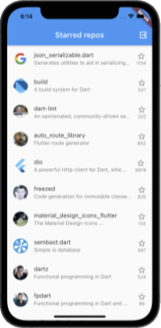

# Reso Coder GitHub Repo Viewer

Production-grade project developed during the Reso Coder Academy Flutter Bootcamp.

It's a mobile Github repository viewer

More info at [Reso Coder](https://resocoder.com/fdb) or at [Reso Coder Academy](https://resocoder.academy)



## How to Start

**Step 1:**

Download or clone this repo by using the link below:

<https://github.com/abibiano/course_resocoder_repo_viewer.git>

**Step 2:**

Go to project root and execute the following command in console to get the required dependencies:

```sh
flutter pub get
```

**Step 3:**

This project uses libraries that works with code generation, execute the following command to generate files:

```sh
flutter packages pub run build_runner build --delete-conflicting-outputs
```

or watch command in order to keep the source code synced automatically:

```sh
flutter packages pub run build_runner watch
```

**Step 4:**

Create an Github OAuth App on **Github Settings|Developer settings|OAuth Apps** with <http://localhost:8080> as Homepage URL

Save the CLIENT_ID and CLIENT_SECRET in a .env file (see .env.sample file as example)

## Code Snippets

### Upgrade pubspec.yaml

```sh
make upgrade

```

### Build iOS

```sh
make build_ios_mobile

```

### Build and watch automatic code generation

```sh
flutter pub run build_runner watch --delete-conflicting-outputs

```
